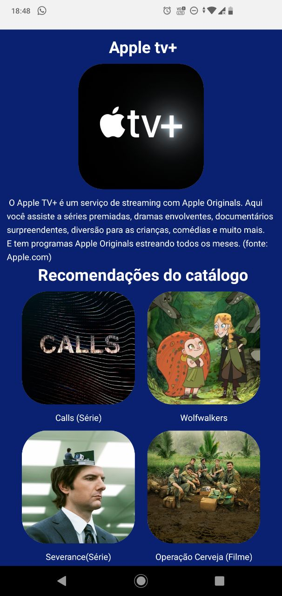

# catálogoDeStreaming
## Projeto realizado na avaliação da matéria de Desenvolvimento de dispositivos móveis, ofertada pelo professor Igor Rosberg, no curso Bacharelado em Ciência e Tecnologia, na Universidade Federal do Rio Grande do Norte.

### O objetivo da aplicação é 

#### O Cátalogo de Streaming foi pensado em uma versão de demonstração de uma aplicação que viria a ser real. Ele apresenta vários serviços de streaming que estão no Brasil, com seu preço (ou o valor mínimo dele). Quando clicado, aparecem informações sobre o serviço em questão e algumas recomendações do catálogo. 

 

  

